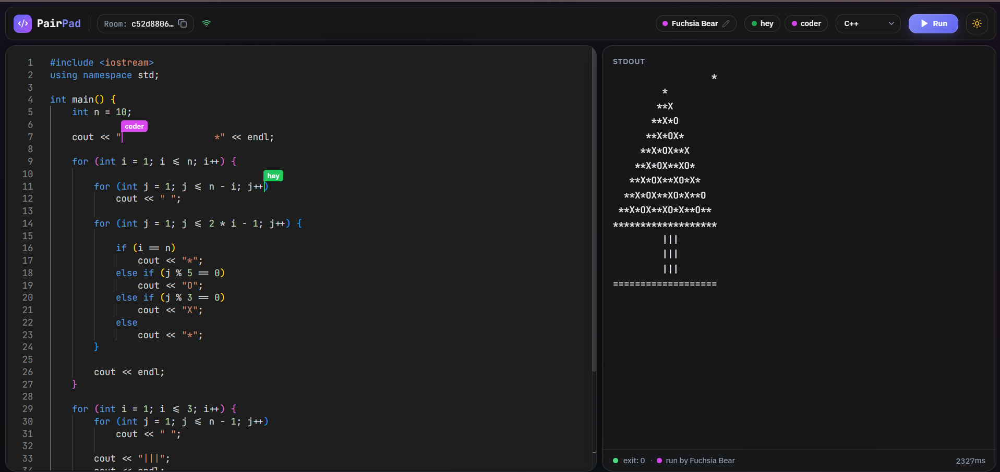

<div align="center">

# ⚡ PairPad

### Google Docs for code — with a Run button.

Share a link. Code together in real time. Execute it in a locked-down Docker sandbox.
No login, no setup, no database.

<br/>

**[🚀 Try it live → pairpad-web.vercel.app](https://pairpad-web.vercel.app)**

<br/>


</div>

---

## 🎬 See it in 30 seconds

1. Open **[pairpad-web.vercel.app](https://pairpad-web.vercel.app)** and click **New Room**
2. Copy the URL into a second tab (or send it to a friend on another device)
3. Type in both — watch edits merge live with named, colored cursors
4. Hit **Run** — the code executes in an isolated Docker container on the server, and *everyone* in the room sees the output and who ran it

> Try to break it: `while True: pass`, a fork bomb, `os.system("rm -rf /")` — the sandbox shrugs it all off.

---

## ✨ Features

- 🔄 **Real-time collaborative editing** — powered by [Yjs](https://yjs.dev) CRDTs, so concurrent edits *never* conflict, even on flaky networks
- 👥 **Live presence** — every user gets an editable name + color, shown as labeled cursors right in the editor
- 🏃 **One-click code execution** — Python, JavaScript, C++, C, Java, and Ruby (Go supported by the backend, awaiting a bigger VM)
- 🔒 **Hardened Docker sandbox** — every run gets a throwaway container: no network, 128 MB RAM, 0.5 CPU, 10-second kill switch
- 📡 **Shared run state** — execution status and output sync through the same CRDT doc, so late joiners see the room's last result too
- 🎨 **Polished UI** — Monaco editor (the engine inside VS Code), glassmorphism design, light/dark themes, ⌘J command palette
- 🪶 **Zero friction** — no accounts, no database; rooms live in memory and expire after 2 hours idle

<br/>



---

## 🏗️ How it works

```
┌─────────────┐   Yjs sync (WebSocket, binary updates)   ┌──────────────────┐
│  Browser A  │ <--------------------------------------> │                  │
│  (Monaco +  │                                          │   Backend        │
│   Yjs)      │            POST /execute                 │   (Node + ws +   │
├─────────────┤ ---------------------------------------> │    y-websocket)  │
│  Browser B  │ <--------------------------------------> │                  │
└─────────────┘                                          └────────┬─────────┘
   (Vercel)                                                       │ dockerode
                                                          ┌───────▼─────────┐
                                                          │ Docker container │
                                                          │ (per execution)  │
                                                          └──────────────────┘
                                                             (Oracle Cloud)
```

### Why CRDTs instead of just broadcasting keystrokes?

Most collaborative editors broadcast edits over Socket.IO — effectively *last write wins*. PairPad uses **CRDTs (Conflict-free Replicated Data Types)**: a data structure whose operations can arrive in any order on any client and still converge to the identical document. That buys real guarantees:

| | Socket.IO broadcasting | Yjs CRDTs (PairPad) |
|---|---|---|
| Concurrent edits | Can be lost or garbled | Merge deterministically, always |
| Bad network | Needs a constant connection | Works offline, syncs on reconnect |
| Latency | Every keystroke round-trips the server | Edits apply locally *instantly* |
| Server's job | Must understand & transform the document | Dumb relay of binary updates |

### The security model — running strangers' code safely

User code is hostile by assumption. Every execution runs in a fresh container with defense in depth:

| Control | Setting | Stops |
|---|---|---|
| 🌐 Network | `NetworkMode: 'none'` | Data exfiltration, crypto-miners, callbacks |
| 🧠 Memory | 128 MB (256 MB for Java), swap off | Host memory starvation → clean OOM kill |
| ⚙️ CPU | ~0.5 CPU shares | Monopolizing the host |
| ⏱️ Time | Hard `SIGKILL` at 10 s | Infinite loops |
| 🍴 Processes | `PidsLimit: 128` | Fork bombs |
| 🗑️ Lifecycle | `AutoRemove: true` | Anything surviving its run |
| 💉 Input | Code base64-decoded *inside* the container | Shell injection on the host |

`rm -rf /` succeeds — inside a container that's deleted milliseconds later. The host never notices. Output is capped at 1 MB per stream so `while True: print()` can't flood the server either.

---

## 🛠️ Tech stack

| Layer | Tech |
|---|---|
| Frontend | React 18 · TypeScript · Vite · Tailwind CSS · Monaco Editor · `motion` |
| Real-time sync | Yjs · y-websocket · y-monaco (CRDT + awareness/presence) |
| Backend | Node 20 · Express · `ws` · dockerode |
| Sandbox | Docker (per-execution containers, resource-capped) |
| Hosting ($0/mo) | Vercel (web) · Oracle Cloud Always Free ARM VM + Caddy auto-HTTPS + PM2 (api) |

---

## 🚀 Run it locally

**Prereqs:** Node 20+. Docker only if you want the Run button (collaboration works without it).

```bash
git clone https://github.com/ProDeveloperAditya/PairPad.git
cd PairPad
npm install

npm run dev:server   # terminal 1 — backend on :4000
npm run dev:web      # terminal 2 — frontend on :5173
```

Open <http://localhost:5173>, create a room, then open the same room URL in a second tab — that's the whole demo.

> **Note:** for Java, name the public class `Main`. Environment overrides live in each app's `.env.example`.

---

## 📁 Project structure

```
apps/
├── web/        Vite + React frontend            → Vercel
│   └── src/    pages/ · components/ · lib/ (yjsClient, languages, theme)
└── server/     Node + TypeScript backend        → Oracle Cloud
    └── src/    index.ts (Express + WS) · yjsRelay.ts (CRDT relay)
                executor.ts (Docker runs) · rooms.ts (2h expiry)
```

---

<div align="center">

Built by **[Aditya Raj](https://github.com/ProDeveloperAditya)** · [LinkedIn](https://www.linkedin.com/in/aditya-raj-developer/)

If PairPad made you smile, a ⭐ makes me smile back.

</div>
